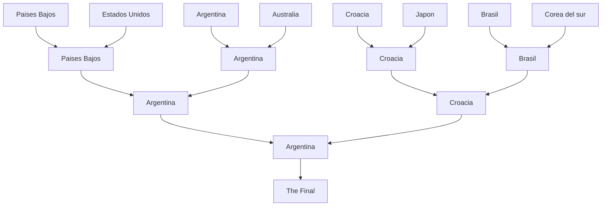

---
# try also 'default' to start simple
theme: seriph
# some information about your slides (markdown enabled)
title: Welcome to Slidev
info: |
  ## Slidev Starter Template
  Presentation slides for developers.

  Learn more at [Sli.dev](https://sli.dev)
# apply UnoCSS classes to the current slide
class: text-center
# https://sli.dev/features/drawing
drawings:
  persist: false
# slide transition: https://sli.dev/guide/animations.html#slide-transitions
transition: slide-left
# enable MDC Syntax: https://sli.dev/features/mdc
mdc: true
# duration of the presentation
duration: 35min
---

# I want to tell you a story

<div @click="$slidev.nav.next" class="mt-12 py-1" hover:bg="white op-10">
  Press Space for next page <carbon:arrow-right />
</div>

<div class="abs-br m-6 text-xl">
  <button @click="$slidev.nav.openInEditor()" title="Open in Editor" class="slidev-icon-btn">
    <carbon:edit />
  </button>
  <a href="https://github.com/slidevjs/slidev" target="_blank" class="slidev-icon-btn">
    <carbon:logo-github />
  </a>
</div>

<!--
The last comment block of each slide will be treated as slide notes. It will be visible and editable in Presenter Mode along with the slide. [Read more in the docs](https://sli.dev/guide/syntax.html#notes)
-->

---
layout: cover
transition: fade-out
background: ./image1.png
backgroundSize: cover
backgroundPosition: center
backgroundDark: 0.2
---
# A very... very.. beautiful story...


<br>
<br>

<!--
Here is another comment.
-->

---
transition: slide-up
level: 1
---

# The story begins on November 22, 2022

And, in reality, it doesn't start off very well...
---
layout: cover
transition: fade-out
background: ./image2.jpeg
backgroundSize: cover
backgroundPosition: center
backgroundDark: 0.5
---

# Argentina 1 - Arabia Saudita 2

But... it will get better... I promise.

<!-- Inline style -->
<style>
.footnotes-sep {
  @apply mt-5 opacity-10;
}
.footnotes {
  @apply text-sm opacity-75;
}
.footnote-backref {
  display: none;
}
</style>

<!--
Notes can also sync with clicks

[click] This will be highlighted after the first click

[click] Highlighted with `count = ref(0)`

[click:3] Last click (skip two clicks)
-->

---
level: 1
layout: cover
transition: fade-out
background: ./image3.jpeg
backgroundSize: cover
backgroundPosition: center
backgroundDark: 0.8
---

# Argentina 2 - Mexico 0

And our souls returned to our bodies...

---
level: 2
layout: cover
transition: fade-out
background: ./image4.webp
backgroundSize: cover
backgroundPosition: center
backgroundDark: 0.5
---

# I kwnow...

I was like that too:

---


# And it just keeps getting better...

<div grid="~ cols-2 gap-4">
<div>

## Argentina 2 - Polonia 0

30 November 2022
</div>

<div>
    
</div>

</div>

<style>
  h2 {
    font-size: 30px;
    margin-top: 100px;
    color: skyblue;
  }
</style>
---
class: px-20
---

# And then, we began to believe it was possible...

And we had reason to be hopeful.

Here are the two reasons:

<div grid="~ cols-2 gap-2" m="t-2">

```yaml
---
Lionel
---
```

```yaml
---
Messi
---
```


</div>

To be continued...

<style>
.my-img {
  width: 100%;
  height: 230px;
  object-fit: fill; /* mantiene proporción */
}
</style>

---

# Here we go...

<div mt-5 v-click>Get ready! This is going to get good...</div>

<div mt-10 v-click>

## Argentina 2 - Australia 1

And it gets better...
</div>

<br>

<div mt-5 v-click>

## Argentina 2 (4) - Holanda 2 (3)

Too much better...
</div>

<v-click>

 <span v-mark.red="3"><code>The</code> promise</span>
of a dream that could come true.
<span v-mark.circle.orange="4">The promise...</span>

<span v-mark.underline.orange>It was no longer a promise... but a reality...</span>

</v-click>

---

# So close...

But, at the same time, so much ground to cover.
```html
  Argentina 3 - Croacia 0
```
<div mt-10></div>
<div class="w-60 relative">
  <div class="relative w-40 h-40">
    
    
    
  </div>

  <div
    class="text-5xl absolute top-14 left-80 text-[#2B90B6] -z-1"
    v-motion
    :initial="{ x: -80, opacity: 0}"
    :enter="{ x: 0, opacity: 1, transition: { delay: 2000, duration: 1000 } }">
    So close...
  </div>
</div>

<!-- vue script setup scripts can be directly used in markdown, and will only affects current page -->
<script setup lang="ts">
const final = {
  x: 0,
  y: 0,
  rotate: 0,
  scale: 1,
  transition: {
    type: 'spring',
    damping: 10,
    stiffness: 20,
    mass: 2
  }
}
</script>

---

# 18/12/2022

This date... would no longer be just another day on the calendar

<div h-3 />

Remember $18/12/2022$

Because...
$$ {1|2|3|4|all}
\begin{aligned} You \\
\nabla \cdot Never \\
\nabla forget\\
\nabla this\\
\nabla Day\\
\end{aligned}
$$

Common...

---

# The Final

Here's the way:



---

# Argentina 3 (4) - Francia 3 (2)

And that's it! The most beautiful ending to this story...


---
foo: bar
---

# Drag the glass so Lio can kiss it 😄

Double click on cup image and just drag...

<div class="relative flex gap-4">
<div>
    <v-drag pos="100,140,168,168">
    
  </v-drag>
</div>
<div>
  
</div>
</div>

---
src: ./pages/imported-slides.md
hide: false
---

---
layout: center
class: text-center
---

# Thank you for getting this far.

## Made for Kenkyo

[GitHub](https://github.com/Kenkyoo)
